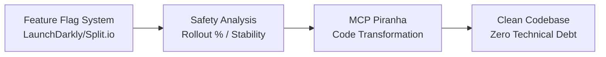

<div align="center">
  
  <h1>Flag Sweeper 🚩</h1>
</div>

## The Problem

Feature flags are essential for modern software development, but they create a hidden technical debt crisis:

- 🏴‍☠️ **Dead flags** remain in production code for months/years
- 🔀 **Branching complexity** makes code harder to understand and maintain
- 🐛 **Bug risk** from outdated conditional logic
- 🚀 **Performance overhead** from unnecessary runtime checks
- 😤 **Developer frustration** navigating flag-polluted codebases

**The reality:** Most feature flags should be temporary, but manual cleanup is time-consuming and error-prone.

## The Solution

A Model Context Protocol (MCP) server that uses Polyglot Piranha to automatically clean up feature flags in your codebase. Transform feature flag calls into their final values based on flag states defined in `flags.json`.

**🎯 Vision:** Connect to live feature flag systems (LaunchDarkly, Split.io, custom experimentation MCP) to automatically identify and safely remove stable flags from your codebase.

## ✨ What This Does

**Before (Feature Flag Hell):**
```go
if isFeatureEnabled("beta_ui") {
    renderBetaUI()
} else {
    renderOldUI()
}

if client.GetString("new_checkout") == "true" {
    processNewCheckout()
} else {
    processLegacyCheckout()
}
```

**After (Clean, Maintainable Code):**
```go
if true {
    renderBetaUI()
} else {
    renderOldUI()
}

if false {
    processNewCheckout()
} else {
    processLegacyCheckout()
}
```

*Next step: Let your compiler/optimizer remove the dead branches entirely!*

## 🚀 Quick Start

1. **Install dependencies:**
   ```bash
   pip install fastmcp polyglot-piranha
   ```

2. **Configure in Cursor:**
   Add to `~/.cursor/mcp.json`:
   ```json
   {
     "mcpServers": {
       "mcp-piranha": {
         "command": "python3",
         "args": ["-m", "mcp-piranha"],
         "cwd": "/path/to/your/project",
         "env": {
           "PYTHONPATH": "/path/to/your/project"
         }
       }
     }
   }
   ```

3. **Create `flags.json` in your project:**
   ```json
   {
     "functions": [
       "isFeatureEnabled",
       "client.GetString",
       "isEnabled",
       "getFlag",
       "is_feature_enabled"
     ],
     "flags": {
       "beta_ui": {
         "value": true,
         "description": "Enables the new beta user interface",
         "replace_with": true
       },
       "new_checkout": {
         "value": false,
         "description": "New payment processing flow",
         "replace_with": false
       }
     }
   }
   ```

## 🛠️ MCP Tools

### `list_flags`
Loads and parses feature flags from `flags.json` in your project directory.

**Parameters:**
- `working_directory` (optional): Directory to search for `flags.json`

**Returns:**
- `flags`: List of flag names
- `flag_details`: Detailed flag information
- `global_patterns`: Function patterns for detection
- `source_file`: Path to the loaded `flags.json`

### `apply_rewrite`
Transforms code by replacing feature flag calls with their final values.

**Parameters:**
- `code`: Source code to transform
- `language`: Programming language (go, java, python, etc.)
- `flag_name` (optional): Specific flag to clean up
- `rules` (optional): Custom Piranha rules
- `edges` (optional): Custom rule edges

**Returns:**
- `transformed_code`: The transformed code
- `message`: Status message

## 📝 `flags.json` Format

JSON format for defining feature flags and detection patterns:

```json
{
  "functions": ["function1", "function2", "function3"],
  "flags": {
    "flag_name": {
      "value": true,
      "description": "Flag description",
      "replace_with": true
    }
  }
}
```

### Format Details

**Functions Array:**
- Array of function names to detect
- Examples: `"isFeatureEnabled"`, `"client.GetString"`, `"isEnabled"`
- Supports any function that takes the flag name as a string parameter

**Flags Object:**
- Object with flag names as keys
- Each flag contains:
  - `value`: Current state (true/false)
  - `description`: Human-readable description
  - `replace_with`: What to replace with when cleaning up

### Example

```json
{
  "functions": [
    "isFeatureEnabled",
    "client.GetString",
    "isEnabled",
    "getFlag",
    "is_feature_enabled",
    "get_flag",
    "flag_manager.is_feature_enabled",
    "config.getBoolean",
    "settings.isEnabled"
  ],
  "flags": {
    "beta_ui": {
      "value": true,
      "description": "Enables the new beta user interface with modern design elements",
      "replace_with": true
    },
    "new_checkout_flow": {
      "value": false,
      "description": "New payment processing flow with improved UX",
      "replace_with": false
    },
    "feature_flag": {
      "value": true,
      "description": "Generic feature flag for testing purposes",
      "replace_with": true
    },
    "legacy_auth": {
      "value": false,
      "description": "Legacy authentication system (deprecated)",
      "replace_with": false
    },
    "debug_mode": {
      "value": true,
      "description": "Enables debug logging and additional error information",
      "replace_with": true
    }
  }
}
```

## 🔧 How It Works

1. **Pattern Detection**: Uses global function patterns to find feature flag calls
2. **Flexible Matching**: Supports various function signatures:
   - `isFeatureEnabled("flag_name")`
   - `isFeatureEnabled("flag_name", arg2)`
   - `isFeatureEnabled(arg1, "flag_name")`
   - `isFeatureEnabled(arg1, "flag_name", arg3)`
3. **Rule Generation**: Creates Piranha rules for each function pattern
4. **Code Transformation**: Replaces flag calls with their final values

## 🧪 Testing

Run tests in the `tests/` directory:

```bash
python3 tests/test_multilayered.py
```

## 📁 Project Structure

```
mcp-piranha/
├── src/
│   ├── __init__.py
│   └── server.py          # Main MCP server
├── tests/
│   ├── test_multilayered.py
│   └── test_*.py          # Additional test files
├── __main__.py            # Entry point
├── flags.json             # Feature flag definitions
├── motivation.png         # The problem we're solving
└── README.md
```

## 🎯 Supported Languages

- **Go** - `isFeatureEnabled()`, `client.GetString()`, custom patterns
- **Java** - `config.getBoolean()`, `featureManager.isEnabled()`
- **Python** - `is_feature_enabled()`, `get_flag()`
- **JavaScript/TypeScript** - Various flag checking patterns
- **C#** - Config-based flag patterns
- **And more** - Extensible via Polyglot Piranha's rule system

## 🔍 Real-World Impact

### Code Complexity Reduction
**Before:** Navigating nested flag conditions
```python
if is_feature_enabled("new_dashboard"):
    if is_feature_enabled("advanced_analytics"):
        render_advanced_dashboard()
    else:
        render_basic_new_dashboard()
else:
    render_legacy_dashboard()
```

**After:** Clear, linear logic
```python
if true:
    if true:
        render_advanced_dashboard()
    else:
        render_basic_new_dashboard()
else:
    render_legacy_dashboard()
```

### Performance Benefits
- ❌ **Runtime flag evaluation** (database/API calls)
- ✅ **Compile-time constants** (zero runtime overhead)
- 🚀 **Dead code elimination** by compilers/bundlers

## 🔮 Future Vision: Enterprise Integration



**Coming Soon:**
- 🔌 **Live flag system integration** - Connect directly to LaunchDarkly, Split.io, Unleash
- 🛡️ **Safety analysis** - Only remove flags with 95%+ rollout and 30+ day stability
- 🔄 **Automated workflows** - CI/CD integration with approval processes
- 📊 **Impact analysis** - Preview changes before applying
- 🎯 **Bulk operations** - Clean entire codebases safely

## 🚨 Troubleshooting

- **"No transformations applied"**: Check that `flags.json` exists and contains the flag
- **"Connection closed"**: Restart Claude Code or the MCP server
- **"Invalid tree-sitter query"**: Ensure function patterns are valid identifiers

## 💡 Why This Matters

> "Feature flags are a powerful tool, but without proper cleanup, they become technical debt that compounds over time. This project automates the tedious but critical task of flag removal, keeping codebases clean and maintainable."

**The goal:** Make feature flag cleanup so easy and safe that it becomes a standard part of every development workflow.
